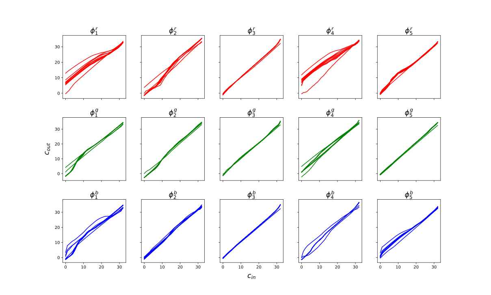
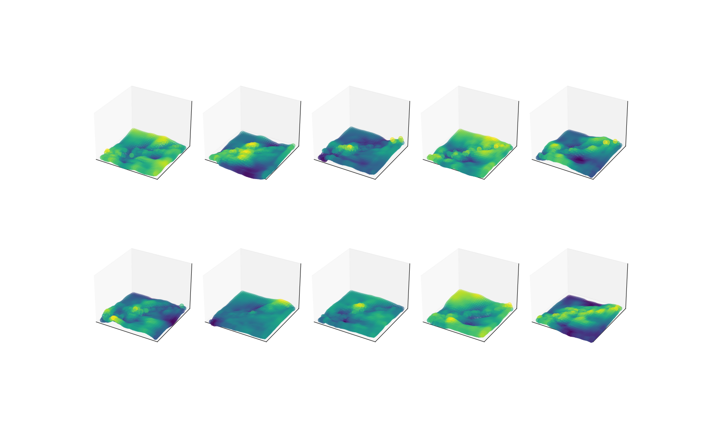
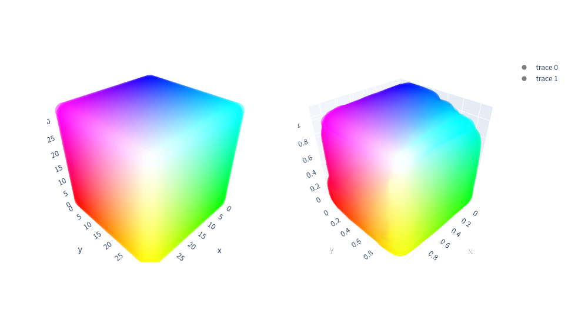
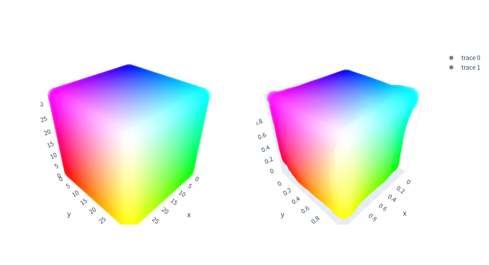
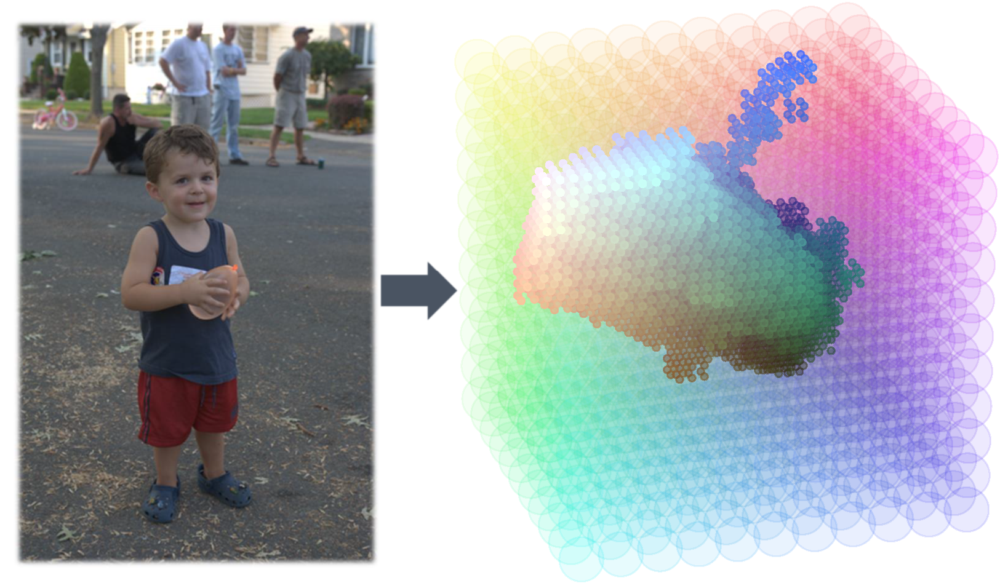

# CLUT: Compressed Representation of 3DLUT
> Two attempts to compress 3DLUTs via learning: low-rank decomposition and hash.
### [**CLUT-Net: Learning Adaptively Compressed Representations of 3DLUTs for Lightweight Image Enhancement**](/doc/MM2022%20CLUT-Net.pdf)
- **Fengyi Zhang**, [Hui Zeng](https://huizeng.github.io/), [Tianjun Zhang](https://github.com/z619850002), [Lin Zhang](https://cslinzhang.gitee.io/home/)
- *ACMMM2022* 

#### 
Framework of our proposed CLUT-Net which consists of 
- A neural network
- *N* basis CLUTs
- Two transformation matrices

The *N* basis CLUTs cover various enhancement effects required in different scenes. The neural network predicts content-dependent weights according to the downsampled input to fuse the basis CLUTs into an image-adaptive one, from which the transformation matrices adaptively reconstruct the corresponding standard 3DLUT to enhance the original input image. 

<!-- All three modules are jointly learned from the annotated data in an end-to-end manner. -->

### [**Adaptively Hashing 3DLUTs for Lightweight Real-time Image Enhancement**](/doc/MM2022%20CLUT-Net.pdf)
- **Fengyi Zhang**, [Lin Zhang](https://cslinzhang.gitee.io/home/), [Tianjun Zhang](https://github.com/z619850002), Dongqing Wang
- *ICME2023* 
#### 
Framework of our proposed HashLUT-based image enhancement network which contains
- N progressive basis HashLUTs
- A collision-compensation network
- An expert network.

The basis HashLUTs not only cover the enhancement effects required by different scenes but also are set with progressive resolutions, cooperating with the collision-compensation network to largely mitigate the impact of hash conflict. The expert network selectively fuses the results of different HashLUTs by predicting image-adaptive weights based on the understanding of the characteristics of the input image.

## Comparison
Our two approaches are approximately contemporaneous (in 2022) and both intend to reduce the parameter amount and improve the performance for 3DLUT-based enhancement models via learning.
- The first approach works by **delicately designed** decomposition of 3DLUT motivated and abided **by its channel correlations**.
- The second approach **directly, randomly, and even roughly** improves the space utilization of 3DLUT through hashing but **compensates afterward**.

Although both have successfully achieved our goal, they exhibit different characteristics.

For example, compressing through decomposition would require a relatively large amount of parameters of transformation matrices than that of the basis CLUTs, while not extra space is needed except for the HashLUTs themselves. The standard 3DLUT would be reconstructed from CLUT but not from HashLUT. Such a relatively implicit representation of HashLUT makes it not easy to regularize with existing tools such as TotalVariance loss and Monotonicity loss.
## Preparation
### Enviroment
    pip install -r requirements.txt

The fast deployment of 3DLUT relies on the CUDA implementation of trilinear interpolation in [Image-Adaptive-3DLUT](https://github.com/HuiZeng/Image-Adaptive-3DLUT).

To install their **trilinear** library: 

    cd trilinear_cpp
    sh setup.sh
> Warning: `import torch` before `import trilinear` 
### Data
- [MIT-Adobe FiveK Dataset](https://data.csail.mit.edu/graphics/fivek/) & [HDR+ Burst Photography Dataset](http://www.hdrplusdata.org/)
    - We use the setting of [Image-Adaptive-3DLUT](https://github.com/HuiZeng/Image-Adaptive-3DLUT) in our experiments, please refer to their page for details and data link.
- [PPR10K](https://github.com/csjliang/PPR10K)

Prepare the dataset in the following format and you could use the provided [FiveK Dataset class](/datasets.py).

    - <data_root>
        - input_train
        - input_test
        - target_train
        - target_test

Or you need to implement your own Class for your customed data format / directory arrangement.

## Training
The default settings of the most hyper-parameters are written in the [parameter.py](parameter.py) file.
To get started as soon as possible (with the FiveK dataset), only the 'data_root' needs to be modified before training.

    python train.py --data_root <path>

By default, the images, models, and logs generated during training are saved in [save_root/dataset/name](/FiveK/).
## Evaluation
We provide several pretrained models on the FiveK datset:
    
- [CLUTNet 20+05+10](/FiveK/CLUTNet_20+05+10/) (25.56 PSNR)
- [CLUTNet 20+05+20](/FiveK/CLUTNet_20+05+20/) (25.68 PSNR)
- [HashLUT 7+13](/FiveK/HashLUT_7+13/) (25.62 PSNR)
- [HashLUT 6+13 SmallBackbone](/FiveK/HashLUT_6+13_SmallBackbone/) (25.57 PSNR) (A lighter version with about 110K params.)
<!-- - [HashLUT 20+05+20: 25.68 PSNR](/FiveK/20+05+20_models/) -->

To evaluate them, just
    
    python test.py --model CLUTNet 20+05+10 --epoch 310
    python test.py --model CLUTNet 20+05+20 --epoch 361
    python test.py --model HashLUT 7+13 --epoch 299
    python test.py --model HashLUT 6+13 SmallBackbone --epoch 367

To evaluate your own trained model of a specific epoch, specify the epoch and keep the other parameters the same as training.

## Visualization & Analysis
- Strong correlations 

    
- Weak correlations 

- Learned matrices

- 3D visualization of the learned basis 3DLUTs **(Left: initial identity mapping. Right: after training)**

- Grid occupancy

All the visualization codes could be found in [utils/](./utils/).

# Acknowledgments
This repo.'s framework and the implementation of CLUTNet are built on the excellent work of Zeng *et al*:
[Learning Image-adaptive 3D Lookup Tables for High Performance Photo Enhancement in Real-time. *TPAMI2020*](https://github.com/HuiZeng/Image-Adaptive-3DLUT)

The multi-resolution HashLUTs are implemented based on the fast hash encoding of NVIDIA [Tiny-CUDA-NN](https://github.com/NVlabs/tiny-cuda-nn). 

Great appreciation to the above work and all collaborators for their efforts!

And hope our work helps! 🌟:

### BibTeX
    @inproceedings{clutnet,
    author = {Zhang, Fengyi and Zeng, Hui and Zhang, Tianjun and Zhang, Lin},
    title = {CLUT-Net: Learning Adaptively Compressed Representations of 3DLUTs for Lightweight Image Enhancement},
    year = {2022},
    isbn = {9781450392037},
    url = {https://doi.org/10.1145/3503161.3547879},
    doi = {10.1145/3503161.3547879},
    booktitle = {Proceedings of the 30th ACM International Conference on Multimedia},
    pages = {6493–6501},
    numpages = {9},
    }

    
