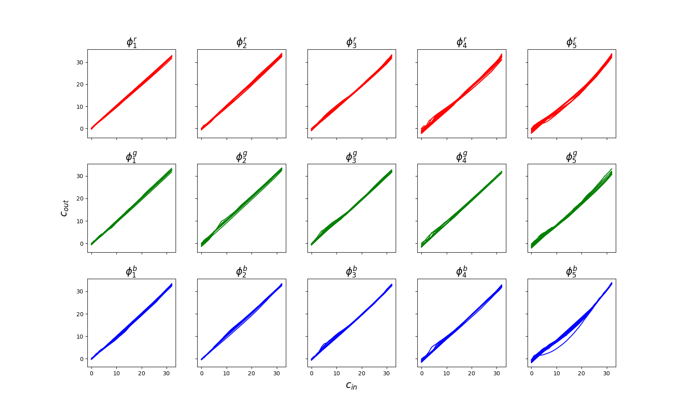
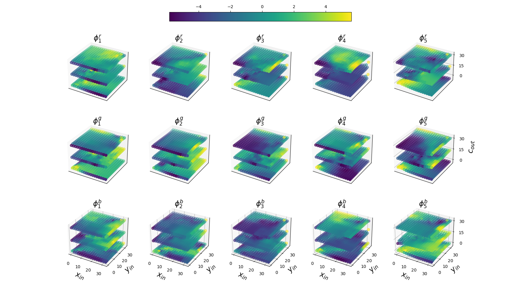
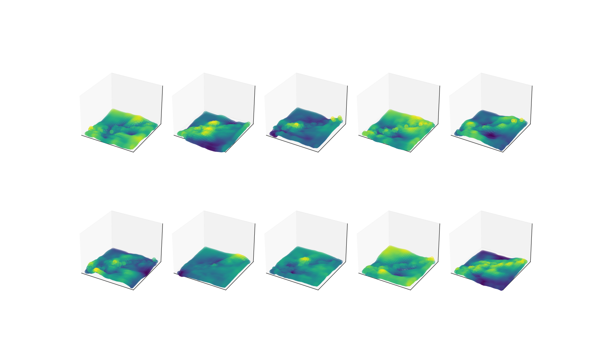
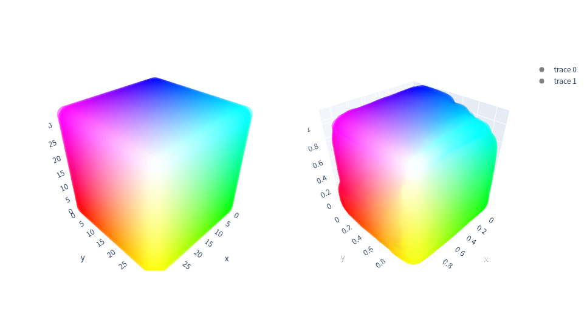
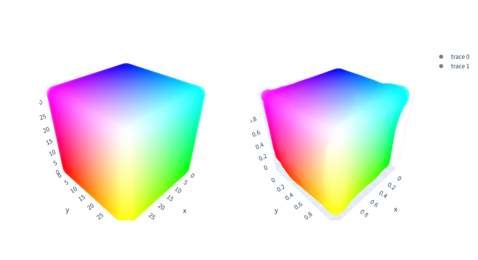

# Core codes for CLUT-Net and tools for 3DLUT
[**CLUT-Net: Learning Adaptively Compressed Representations of 3DLUTs for Lightweight Image Enhancement**](https://cslinzhang.gitee.io/home/ACMMM2022/fengyi.pdf)

Fengyi Zhang, [Hui Zeng](https://huizeng.github.io/), [Tianjun Zhang](https://github.com/z619850002), [Lin Zhang](https://cslinzhang.gitee.io/home/)

*ACMMM2022* 
## Preparation
### Enviroment
    pip install -r requirements.txt
### Data
- [MIT-Adobe FiveK Dataset](https://data.csail.mit.edu/graphics/fivek/) & [HDR+ Burst Photography Dataset](http://www.hdrplusdata.org/)

    - For the utilized FiveK and HDR+ dataset, please refer to https://github.com/HuiZeng/Image-Adaptive-3DLUT.
- [PPR10K](https://github.com/csjliang/PPR10K)

Prepare the dataset in the following format and you could use the provided [FiveK Dataset class](/datasets.py).

    - <data_root>
        - input_train
        - input_test
        - target_train
        - target_test

Or you need to implement your own Class for your customed data format / directory arrangement.

## Training
The default settings of the most hyper-parameters are written in the [parameter.py](parameter.py) file.
To get started as soon as possible (with the FiveK dataset), only the 'data_root' needs to be modified before training.

    python train.py --data_root <xx>

By default, the images, models, and logs generated during training are saved in [save_root/dataset/name](/FiveK/20%2B05%2B10_models/).
## Evaluation
We provide a pretrained model with 25.56 PSNR on the FiveK datset. 

Just
    
    python evaluate.py --model 20+05+10 --epoch 310

To evaluate your trained model of a specific epoch, remember to keep the other parameters the same as training.

## Visualization & Analysis
- Strong correlations 

    
- Weak correlations 

- Learned matrices

- 3D visualization of the learned basis 3DLUTs **(Left: initial identity mapping. Right: after training)**

All the visualization codes could be found in [utils/](./utils/).
# Acknowledgement
Our work is built on the excellent work and implementation of Zeng *et al*.

[Learning Image-adaptive 3D Lookup Tables for High Performance Photo Enhancement in Real-time](https://github.com/HuiZeng/Image-Adaptive-3DLUT)
*TPAMI2020*

    